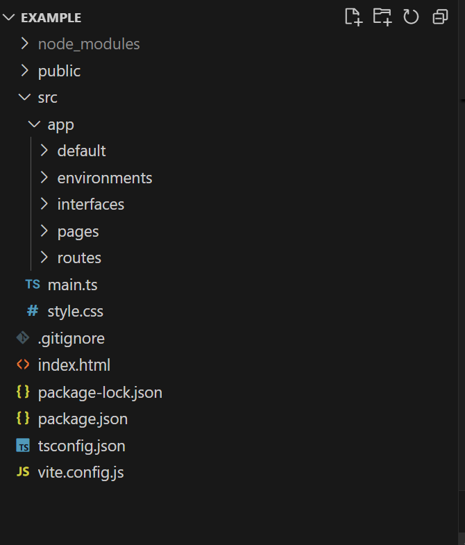
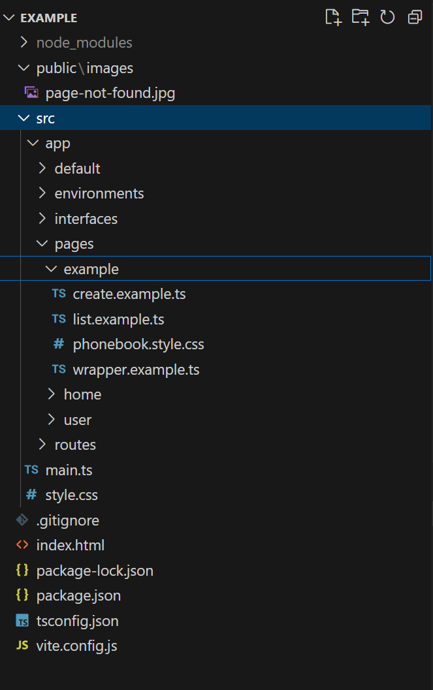

## Folder Structure

So lets look at the structure of the project

Here you have a root folder called Example

Public - This folder should contains images

src - This folder contains all the  code.

​	default - This folder has the system code.

​	environments - This folder has all the environment variables

​	interfaces - defines all the interfaces

​	pages - this will have all the user pages / widgets

​	routes - contains routes of the project

​	main.ts - this is the main starting point of the project.

package.json - package file of the project.

To write a package you must start by creating your own folder.

 In our example we will start by the example . So you can see how we organize this example  below.

