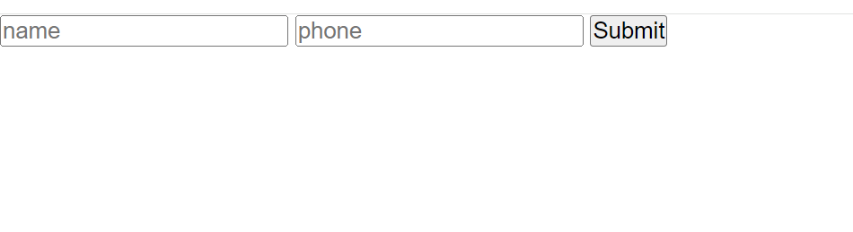

## Create


To Create inside of a widget system you have to first create an html for the form.

```
// src/app/pages/example/create.example.ts

import { StatefulWidget } from "../../default/StatefulWidget";

export class create extends StatefulWidget{

    /**
     * Since there is no other data to be fetched then we just render after the component 			has been mounted.
     * If there was certain data you want to populate then you would put it here.
     */
    widgetDidMount(): void {

        this.render();
    }


    /**
     * This is the main html component of our creating widget.
     * @returns returns a form that takes in name and number for the phone book.
     */
     getHtml(): string {
        let html = "";
        html = `<div>
        <form>
            <div>
                <input type= number id=id hidden>
                <input type = text id="name" placeholder="name">
                <input type = number id="phone" placeholder="phone">
                <button id="submit" type=submit>Submit</button>
            </div>
        </form>

        </div>`
        return html;
    }
}
```


You also need to add the route for this in your routes.ts inside your RouteParams array.


```
  {
    path: "/example",
    linkLabel: "Example",
    content: create,
  },
```


After this you can start the server using npm run dev which will start your server  (for eg: localhost:5173)


This will give you the output of the form that you just created.




Congratulations you have just created your first widget. Now this widget does nothing so we have to change that. Firstly you need to add events to this form . So we have created an aptly named function in the widget that is named addEvents().

 You can add all your user events on this function. So lets do that. Suppose we are creating a new composition called "the_phonebook". Then you will have to create this data structure in the freeschema data fabric using three inbuilt functions. 

```
// this function is used to create a concept. Here type is the type of the concept
// for example first_name is the type in the relation first_name: harry
// harry is the referent/value.
// composition is the flag that determines wether the value will be unique or not 
// userId is the userId that the user has who creates this concept.
// accessId is the level of access you want this concept to have. 4 being its just accessible by you.

function MakeTheInstanceConceptLocal(type: string, referent: string, composition: boolean | undefined, userId: number, accessId: number, sessionInformationId?: number, referentId?: number): Promise<Concept>;
```

```
// this is to create the connection between two concepts.
// think of this as a connecting link between the two data points.

function CreateTheConnectionLocal(ofTheConceptId: number, toTheConceptId: number, typeId: number, orderId?: number, typeString?: string, userId?: number): Promise<Connection>;
```

```
// this is used to sync our local data to the cloud for permanent storage.
LocalSyncData.SyncDataOnline(): Promise<Concept[]>;
```


With all of that in mind we will then start creating data and persisting them from here.

Now we are here to create data

we need to add events to the form. There is a submit button there so we will add event just on the submit button. So now on submit button click we are getting the value from name form element and phone form element and then pushing those into a data we are also then creating concepts and connections from it.

```
    /**
     * These are the events that user adds. These could be any thing like populating the data to creating the data
     * 
     */
    addEvents(): void {
        let name = this.getElementById("name") as HTMLInputElement;
        let phone = this.getElementById("phone") as HTMLInputElement;
        let id = this.getElementById("id") as HTMLInputElement;
        if(this.data){
            name.value = this.data.name;
            phone.value = this.data.phone;
            id.value = this.data.id;
        }
        let submitButton = this.getElementById("submit");
        if(submitButton){
            submitButton.onclick = (ev: Event) => {
                ev.preventDefault();
               MakeTheInstanceConceptLocal("the_phonebook", "", true,999,4).then((mainconcept)=> {
                    console.log("this is for the sync", mainconcept);
                    MakeTheInstanceConceptLocal("name", name.value,false, 10267, 4).then((concept)=>{
                        MakeTheInstanceConceptLocal("phone", phone.value, false, 999,4).then((concept2) => {
                            CreateTheConnectionLocal(mainconcept.id, concept.id, mainconcept.id, 1, "", 999).then(()=>{
                                CreateTheConnectionLocal(mainconcept.id, concept2.id, mainconcept.id, 1, "", 999).then(()=>{
                                    LocalSyncData.SyncDataOnline();
                                })
                            })
                        });
                    });
                }).catch((err)=>{
                    console.error("this is the error", err);
                })
    
                
            }
        }

    }
```


This will create the data. You can verify if the data has been created by looking at the networks tab there you can see local-concepts named network event. This will contain all the concepts and connections that are created.

