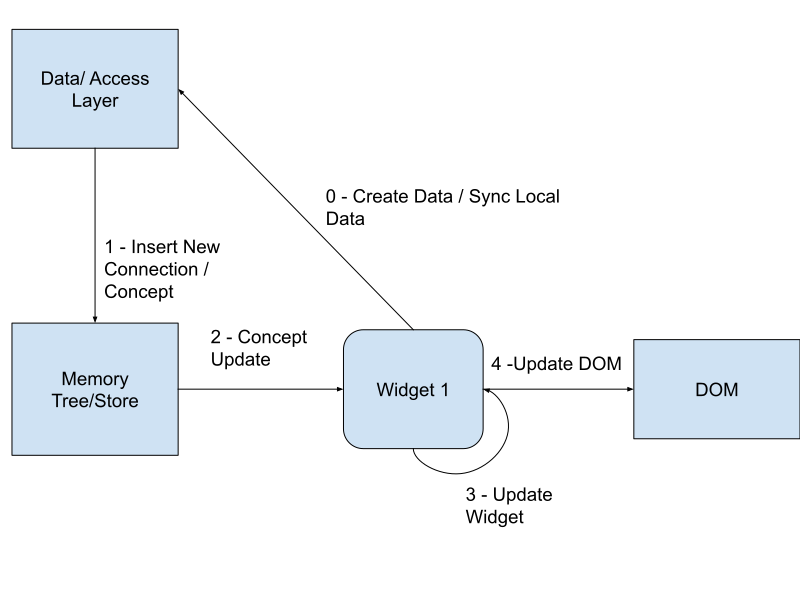

## Memory Tree

For our system to function effectively, the presence of concepts and their connections is essential throughout. To support this, we’ve implemented a memory store at every layer of the concept-connection architecture. This store retains concepts and connections, enabling us to build and retrieve data more efficiently from its foundational elements.

Each layer benefits from this memory structure, particularly the user layer. In this layer, we use Balanced Binary Trees to store concepts and connections for quicker access. These can be preloaded using AI or retrieved manually upon each request. Manual fetching, however, may increase the initial load time, as necessary data must be retrieved every time it's needed.

Currently, there are three key memory trees:

1. Concept Tree: Stores all concepts using their IDs as keys. This serves as the main in-memory reference for concepts, allowing quick lookups by ID.

2. Connection Tree: Stores all connections with their IDs as keys. Like the Concept Tree, it serves as the primary in-memory source for connections.

3. Connection-Of Tree: Contains references to all connections associated with a specific of_the_concept_id. This tree makes it easy to access the latest updates tied to a particular concept.

Whenever any of these trees are updated, the changes automatically propagate to the widgets, which then trigger updates to the DOM.

<h2>How Widget Interacts with the DOM </h2>

When a new widget is created in the system, it may or may not have a data listener attached. If it does, the widget will listen for events related to concepts or connections. When a new concept is created, it's updated in both the Local Memory Tree and the higher-level data layer. This update triggers the Memory Tree to emit an event, notifying the widget to re-render. As a result, the widget refreshes and the DOM is updated accordingly.

In essence, any change in the memory tree will automatically update the associated widgets that are subscribed to those changes via listeners.

This system is compatible with popular JavaScript frameworks like React and Angular, though some adjustments may be needed. Currently, not all freeschema functions trigger memory tree updates, but improvements are ongoing.
