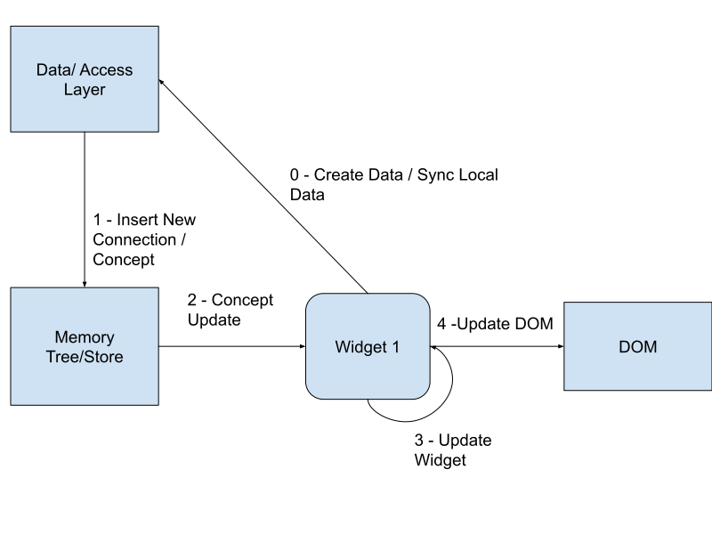

## Memory Tree

Concept and connection needs to be everywhere for our system to work. For this we have created a memory store in each layer of the concept connection system. This memory store holds concepts and connections which can help us acccess and build data faster from its atomic components. 

In each layer this memory tree is useful, more so in the user layer. In the user layer. There is are Balanced Binary Tree that hold concepts and connections for faster access. These concepts and connections can be preloaded via AI or can be manually fetched on each request. The manual fetch might cause the preload time to be greater than intended because on each request the required concepts and connections must be fetched.

There are 3 major memory trees right now.

1. Concept Tree - This holds all the concepts as values and id as its key. This helps us find the concept faster just with its concept id. This is our primary memory copy of concept.

2. Connection Tree - This holds all the connections as values and id as its key. This helps us find the connection faster with its connection id. This is our primary memory copy of connection.

3. Connection Of Tree - This holds all references to connection which have the same of_the_concept_id. This helps us get the new updates on the tree for a specific concept.

When any of these tree have any kind of update then these will update the widgets and that in turn will update the DOM.

<h2>How Widget Interacts with the DOM </h2>

Whenever you create a new widget in the system it might or might not have a data listener attached to it. If there is a data listener attached to it then the widget will listen for a concept/ connection event. When you create a new concept that concept is updated in the Local Memory tree and also in the upper data layer. When the Memory tree is updated it will publish an event which will cause the widget to know that it needs to re-render. This re-rendering process in turn updates the DOM. 

So, Any update on the memory tree will update its corresponding widgets (which are listening to the change via the listener).

This will work with any existing javascript framework like React, Angular albeit with certain modifications. Not all functions in freeschema currently ensure memory tree update but we are updating it as we go.
