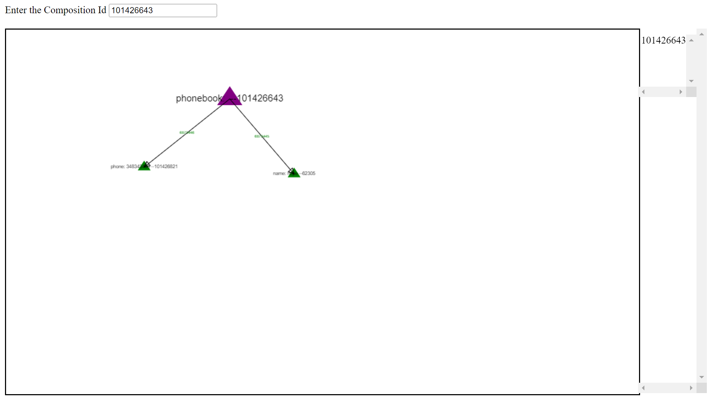

# Visualization

Freeschema is a visual framework. Data can be visualized easily. You will need the concept id to see your data relations. For example. I have a phonebook with the id 101426643 created. You can get this id from the concept created (If its a negative id then its just a local concept if its a positive one then you can visualize it.)

This id is currently public for everyone so you can also see it if you open https://vccs-live.freeschema.com/

After you press enter when you insert this id to the input you will see a triangle appear in the canvas. When you double click this you can see its data componenents.

