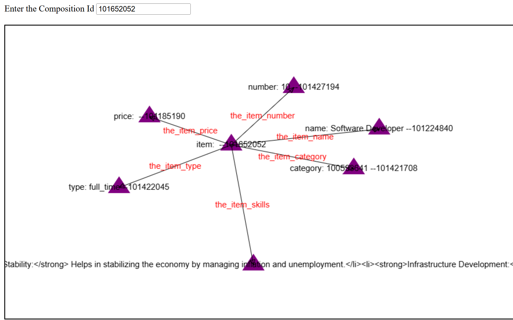
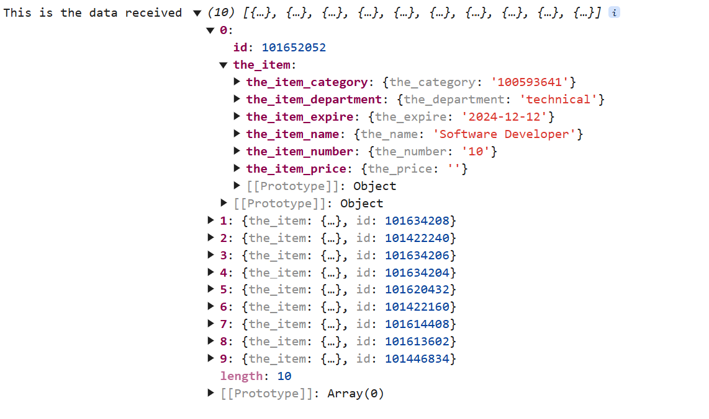
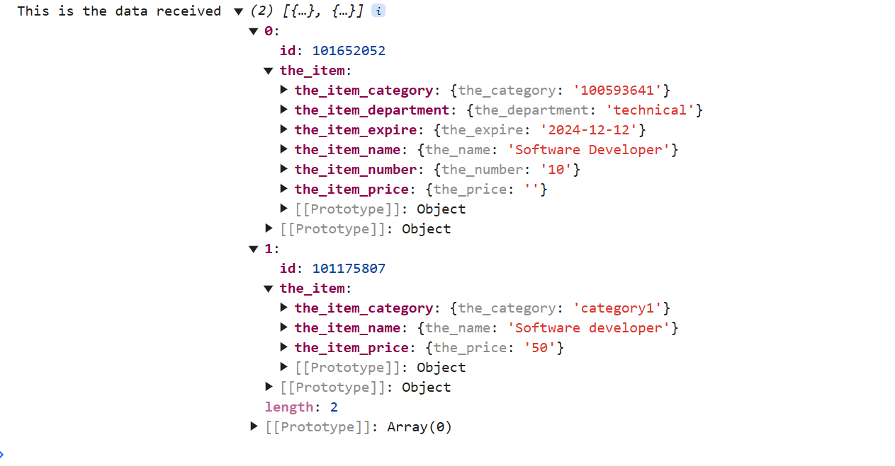
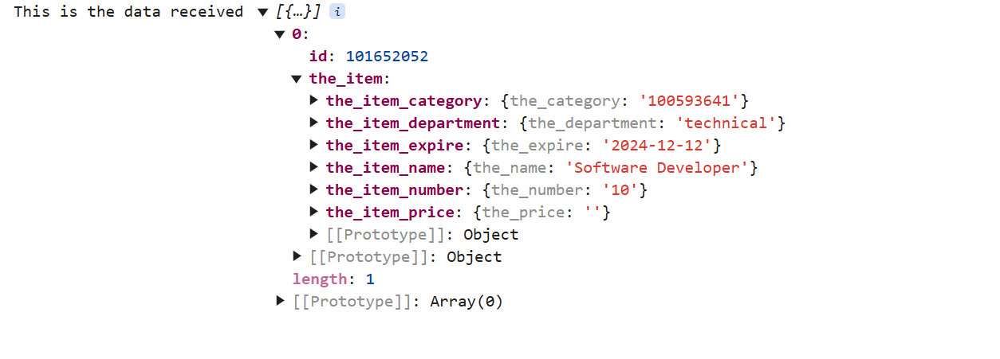

<h1>Querying in Freeschema</h1>

<p>
    Querying in freeschema is an intuitive endeavour. We need to able to visualize the relationships in the visual manner to do it effectively.
    Let's suppose there is a thing called the_item in our system. We need to get all of the the_item in our system. We also need some properties of the the_item such as the_item_name, the_item_price etc.
    Let's see how we are able to do that.
</p>




Now we should be able to get this element by just the type the_item.

We should be able to list 10 of these if they are available in the system.

We could do this by creating a query

```

        let nameConnection: FreeschemaQuery = new FreeschemaQuery();
        nameConnection.typeConnection = "the_item_name";
        nameConnection.name = "itemname";


        let freeschemaQuery: FreeschemaQuery = new FreeschemaQuery();
        freeschemaQuery.type = "the_item";
        freeschemaQuery.name = "top";
        freeschemaQuery.freeschemaQueries = [entityWidgetCode];
        freeschemaQuery.selectors = ["the_item_price","the_item_category", "the_item_s_image", "the_item_number","the_item_department","the_item_expire"]

        freeschemaQuery.outputFormat = NORMAL;
        freeschemaQuery.inpage = 10;
        
        SchemaQueryListener(freeschemaQuery, "").subscribe((data: any)=>{
          console.log("This is the data received",data );
        })

```



This is the output received from the query above.

Let's suppose you want to only filter the items which have name "Software Developer". Then we could add a filter to that.


```
        let nameConnection: FreeschemaQuery = new FreeschemaQuery();
        nameConnection.typeConnection = "the_item_name";
        nameConnection.name = "itemname";


        let itemFilter: FilterSearch = new FilterSearch();
        itemFilter.type= "the_name";
        itemFilter.search = "Software",
        itemFilter.logicoperator = "like";
        itemFilter.name = "namefilter";
        itemFilter.operateon = "itemname";
        itemFilter.composition = false;


        let freeschemaQuery: FreeschemaQuery = new FreeschemaQuery();
        freeschemaQuery.type = "the_item";
        freeschemaQuery.filterLogic = "( namefilter )"
        freeschemaQuery.filters = [itemFilter];

        freeschemaQuery.name = "top";
        freeschemaQuery.freeschemaQueries = [nameConnection];
        freeschemaQuery.selectors = ["the_item_price","the_item_category", "the_item_s_image", "the_item_number","the_item_department","the_item_expire"]

        freeschemaQuery.outputFormat = NORMAL;
        freeschemaQuery.inpage = 10;


        SchemaQueryListener(freeschemaQuery, "").subscribe((data: any)=>{
          console.log("This is the data received",data );
        })

```


Then the output will be like



Here we added a filter to this

Filter has certain parameters

```
        let itemFilter: FilterSearch = new FilterSearch();
        // this is the type of the searching parameter
        itemFilter.type= "the_name";
        
        // this is the actual value that we are searching for
        itemFilter.search = "Software",
        
        // this is the operator for the filter.
        itemFilter.logicoperator = "like";
        
        // this is the freeschemaquery name that we are operating on
        itemFilter.name = "namefilter";
        
        // this is the name of the filter.
        itemFilter.operateon = "itemname";
        
        itemFilter.composition = false;
        
```


Let's suppose you want to filter something with department "technical" you could also do this


```
        let nameConnection: FreeschemaQuery = new FreeschemaQuery();
        nameConnection.typeConnection = "the_item_name";
        nameConnection.name = "itemname";
        
        // new added query for department
        let departmentConnection: FreeschemaQuery = new FreeschemaQuery();
        departmentConnection.typeConnection = "the_item_department";
        departmentConnection.name = "itemdepartment";


        let itemFilter: FilterSearch = new FilterSearch();
        itemFilter.type= "the_name";
        itemFilter.search = "Software",
        itemFilter.logicoperator = "like";
        itemFilter.name = "namefilter";
        itemFilter.operateon = "itemname";

		// this is the new department filter added.
        let departmentFilter: FilterSearch = new FilterSearch();
        departmentFilter.type= "the_department";
        departmentFilter.search = "technical",
        departmentFilter.logicoperator = "like";
        departmentFilter.name = "departmentfilter";
        departmentFilter.operateon = "itemdepartment";


        let freeschemaQuery: FreeschemaQuery = new FreeschemaQuery();
        freeschemaQuery.type = "the_item";
        
        // filter logic is also updated here so that we can do an AND logic
        freeschemaQuery.filterLogic = "( namefilter AND departmentfilter )"
        freeschemaQuery.filters = [itemFilter,departmentFilter];

        freeschemaQuery.name = "top";
        freeschemaQuery.freeschemaQueries = [nameConnection,departmentConnection];
        freeschemaQuery.selectors = ["the_item_price","the_item_category", "the_item_s_image", "the_item_number","the_item_expire"]

        freeschemaQuery.outputFormat = NORMAL;
        freeschemaQuery.inpage = 10;


        SchemaQueryListener(freeschemaQuery, "").subscribe((data: any)=>{
          console.log("This is the data received",data );
        })
```

Here we have added another query to the graph called departmentConnection.

We also have added a department connection filter. After this we receive.



This will help us enable to filter by department and name.
