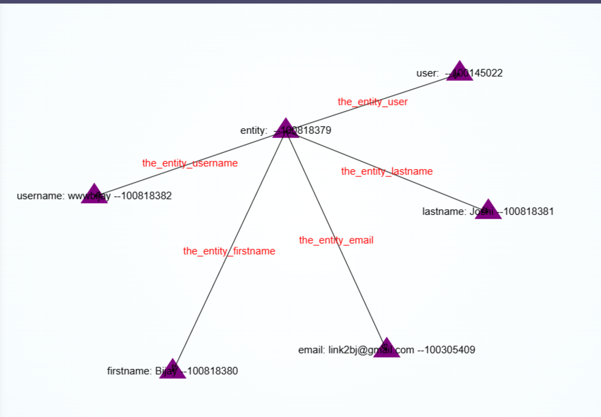

<h3>Entity</h3>
Entity is a construct by which concept connection system can segregate data. Entity is something that is alive, dynamic and which causes the data / system to change.
Entity is an important feature of the concept connection system.
Entity is created when you signup to the system. Every user is associated with some entity. 
An entity can choose from different types. For eg. Person, Company, School etc.

We have this construct of entity because this will help us discern a user from it's entity. A user is only used to login to the system. The Entity describes how he behaves in the system.

Example of Entity is 

Entity is also a proper way to store connections. Connections are stored in entity so that we can easily access the connections and data from entity.

When you login to the system you will be provided with multitude of data, including roles, userId, entityId, userConceptId etc.
