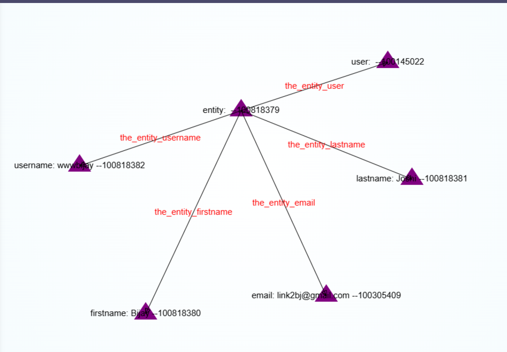
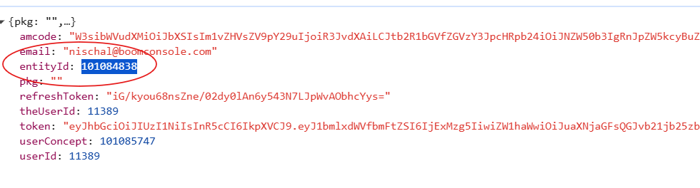

<h2>Entity</h2>
Entity is a construct by which concept connection system can segregate data. Entity is something that is alive, dynamic and which causes the data / system to change. Entity is a concept by itself and it has various connections comming out from it.
Entity is created when you signup to the system. Every user is associated with some entity. 
An entity can choose from different types. For eg. Person, Company etc.

We have this construct of entity as this will help us discern a user from it's entity. A user is only used to login to the system. The Entity describes how he behaves in the system.

## Example of Entity is 

Entity is also a proper way to store connections. Connections are stored in entity so that we can easily access the connections and data from entity.

When you login to the system you will be provided with multitude of data, including roles, userId, entityId, userConceptId etc.

### **Types of Entity**
Entity has multiple types but currently in our system there are 
<li>Person</li>
<li>Company</li>

### **Why Entity?**
Entity is a glue in the concept connection system that hold everything together, an entity is anything that can change, update, add data in the system. An entity can be anything a person, a company, a program etc. So there is always a point from which the data can start, end and uniqueness can be set.

For example if an entity is creating some data it can create a connection from the entity to it's data. For example a widget that an entity creates can be connected as the_entity_s_widget.

You might be asking if we are an unstructred database why am i showing you this ontology of the_entity? Well in an unstructured data also we need some sort of structure so that we 

### **How an Entity is created ?**

An entity is created when the user signs up to the system. When the entity  the following properties are assigned to the entity

- the_entity_type
- the_entity_username
- the_entity_firstname
- the_entity_lastname
- the_entity_user

these all are part of the entity that is why these have the structure **the_entity + to_the_concept_type**

there are other concepts that the entity creates and that are owned by the entity these are kept as 

- the_entity_s_widget
- the_entity_s_client

these kind of connections define ownership of the entity **the_entity + "_s" + to_the_concept_type**.

**In English, an apostrophe followed by "s" ( 's ) is used to show possession or that something belongs to someone or something. Here we are replacing the apostrophe by underscore to assign ownership**

**How to access Entity**

When you login to the system you will receive your entityId, userConceptId and userId that helps you naviagate into the system.

We are currently using localStorage in the browser to store these and use these. Here you can find it under the key "profile" in Local Storage with a property entityId.

  

