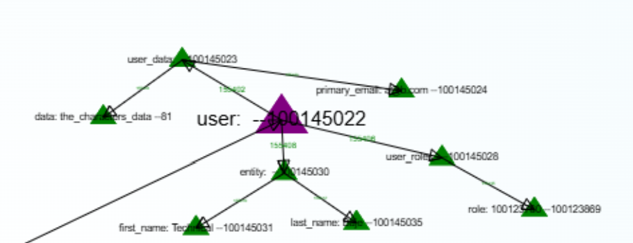
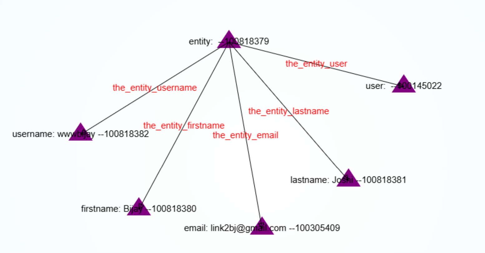

## Connection Types

There are mostly two types of connections that we create.

1.  Compositional connections that are used to store information in the composition / concept which are inherent to the system. This is done so that it is easier to access the data without the knowledge of the connection types.
Example of compositional connections are 

2. Connection Typed Connections are those connections which follow a strict connection type relationship in the freeschema fabric. To create these connections we must first create a type for eg. "the_entity_username", "the_entity_name" etc.

