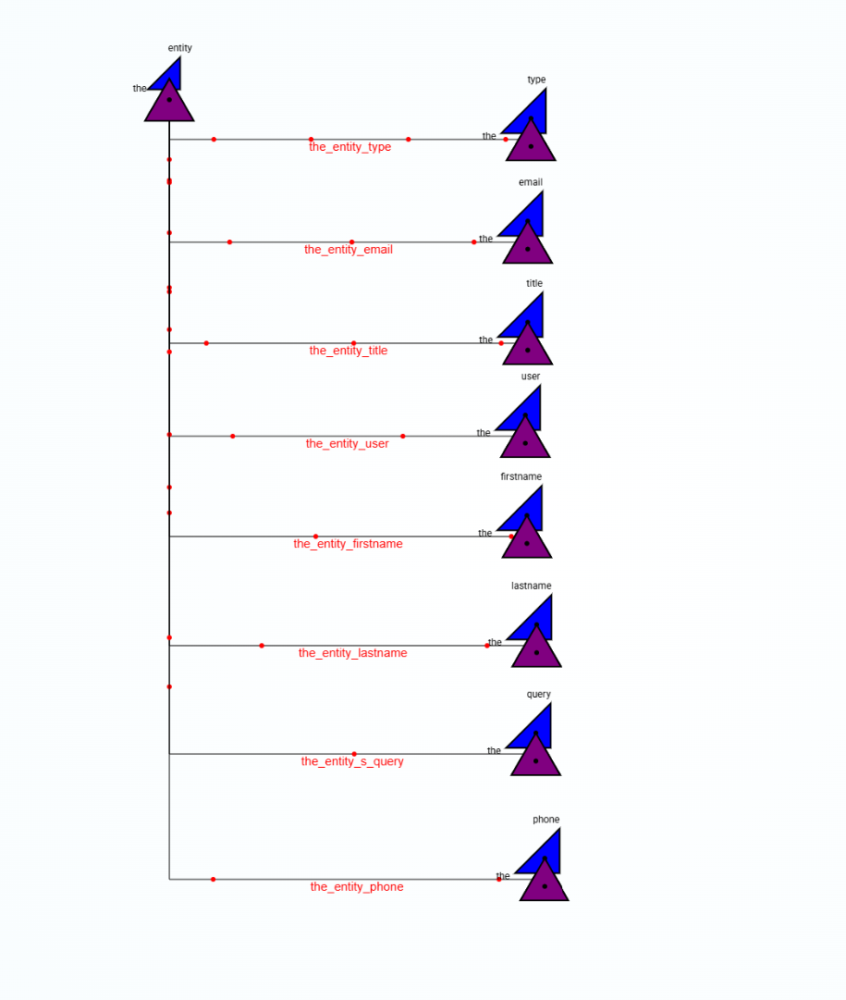
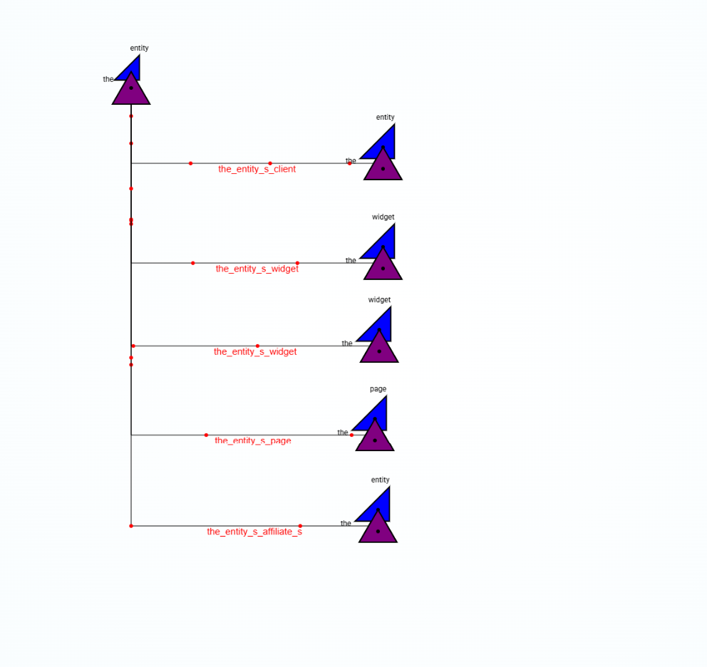
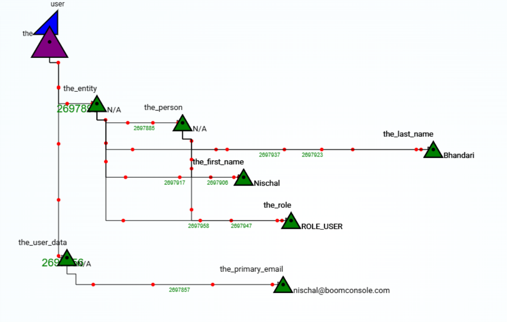

## Connection Types

There are mostly two major kinds of connections that we create.

1. **Type Connections** are those connections which follow a strict connection type relationship in the freeschema fabric. To create these connections we must first create a type for eg. "the_entity_username", "the_entity_name", "the_entity_s_client" etc. The connections that we create have types and these types define the realationships between two concepts. There are two kinds of connections one that defines it **self** and another that defines **ownership**. For example and entity has an email that is the entity itself then it will be connected as a connection with type the_entity_email but let's suppose that the entity owns a chair then it will be connected as the_entity_s_chair. 

**In English, an apostrophe followed by "s" ( 's ) is used to show possession or that something belongs to someone or something.**

Here we show to you two kinds of connections.

**Figure:** *Self Connections*

**Figure:** *Ownership Connections*

2.  **Compositional connections(Legacy)** that are used to store information in the composition / concept which are inherent to the system. This is done so that it is easier to access the data without the knowledge of the connection types.
Example of compositional connections are 

