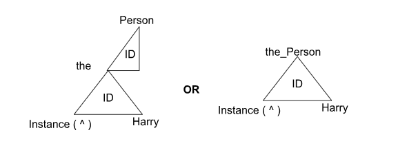
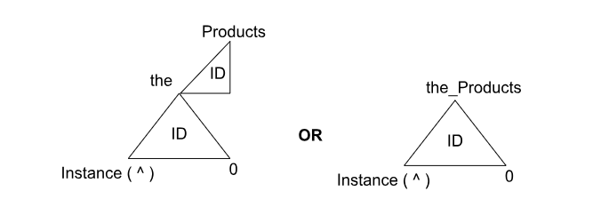

## 
# Concept

Concept in freeSCHEMA are the fundamental building blocks, representing data objects like users, products, or documents. Each concept has the following key elements:

* **ID:** A unique identifier for the concept.  
* **Category:** The broad group to which the concept belongs (e.g., a person, product, or document).  
* **Type:** Specifies the kind of entity the concept represents (e.g., a customer, electronic product, or report).  
* **Referent:** The actual data or value (e.g., a person's name, a product's model, or a document's title).

### **Types of Concept**

Concept in freeSCHEMA can be of two types: **Typological /Type Concept** and **Instance Concept**.

#### **a) Typological /Type Concepts:**

A **Type Concept** is a foundational concept that defines a category or class of entities in the system. In freeSCHEMA, type concepts are only created **once** and reused throughout the system. These concepts serve as templates for instance concepts. In freeSCHEMA, a type concept is visually represented by a **right-angled triangle** and always has the prefix "the\_" (e.g., 'the\_Person').

**Key Points:**

  * **Category (left corner):** The category or class to which this type belongs.  
  * **Concept ID (center):** A unique identifier for the type concept in the system.  
  * **Subtype (top):** The specific name of the type, such as "Person" or "Product."  
  * **Referent (right corner):** Always null, as type concepts do not represent specific instances.


**Visual Representation**


**Code Example:**
```typescript
MakeTheTypeConceptLocal(
  typeString: string,     // The name of the type (e.g., 'Person')
  sessionId: number,      // The current session ID
  sessionUserId: number,  // The user ID who is creating or managing the session
  userId: number          // The user ID creating the type concept
);
```

**Visual Representation**


* **Category (left corner)**: **the** — this type belongs to a general category called "the\_."  
* **Concept ID (center)**: this is the system's unique identifier for the type "the\_Person."  
* **Subtype (top)**: **the\_Person** — the specific type being defined, which is "Person."  
* **Referent (right corner)**: **null** — type concepts do not have a referent value.  
  Once created, this type concept can be used to generate multiple **instance concepts** like "John Doe" or "Jane Smith," both of which would be specific instances of **the\_Person**.  
  In freeSCHEMA, once a type concept is created, it remains part of the system and can be referenced whenever new instances of that type are created. This enables the system to maintain a structured and reusable data framework for managing various types of concepts across different contexts.

  #### **b) Instance Concept**

  An **Instance Concept** in freeSCHEMA represents a specific occurrence of a **Type Concept**, such as "Harry" for the **Type Concept** **"Person"**. It is visually depicted as an **upward-pointing triangle**.  
  **Key Elements:**  
* **ID (center of the triangle):** The unique identifier for the instance concept within the system.  
* **Concept Type (top of the triangle):** The type from which this instance concept is derived. For instance, "Person" in the case of "Harry".  
* **Referent (right-hand side of the triangle):** The actual value represented by the instance concept (e.g., "Harry").


**Visual Representation**


**Code Example:**
```typescript
MakeTheInstanceConceptLocal(
  type: string,           // Type of concept (e.g., 'Person')
  referent: string,       // The specific instance (e.g., 'Harry')
  composition: boolean,   // Whether the concept is compositional or not
  userId: number,         // ID of the user creating the concept
  accessId: number        // Access level
);
```

**Instance concept can also be of two types:**

**i) Instance Value Concept:** An Instance Value Concept is unique and created only once for each combination of type and character value. For example, there can be only one instance of **Person** with the value "**Harry**", ensuring each instance is distinct within the system.

**Code Example:**
```typescript
 MakeTheInstanceConceptLocal(
    "Person",     // Type of concept (e.g., 'Person')
    "Harry",      // The specific value (e.g., 'Harry')
    false,        // Not compositional
    userId,       // User ID creating the instance
    4             // Access level 
);
```

**Visual Representation**




#### 

**ii) Instance Compositional Concept:** 

An **Instance Compositional Concept** is a more complex structure that can contain other **value concepts**. It’s similar to an object in **Object-Oriented Programming (OOP)**, where a single object can hold multiple attributes or other objects. Typically, these concepts have an empty character value (`""`) and may have a **referent ID** of 0, indicating that they serve as containers for other concepts. This is useful for representing more complex data structures, like a **"Person"** containing details such as **name**, **address**, and **email** each represented as separate concepts.

**Code Example:**
```typescript
MakeTheInstanceConceptLocal(
    "Person",   // Type of concept (e.g., 'Person')
    "",          // No direct value (compositional)
    true,        // This is a compositional concept
    userId,      // User ID creating the instance
    4            // Access level
);
```


**Visual Representation**




