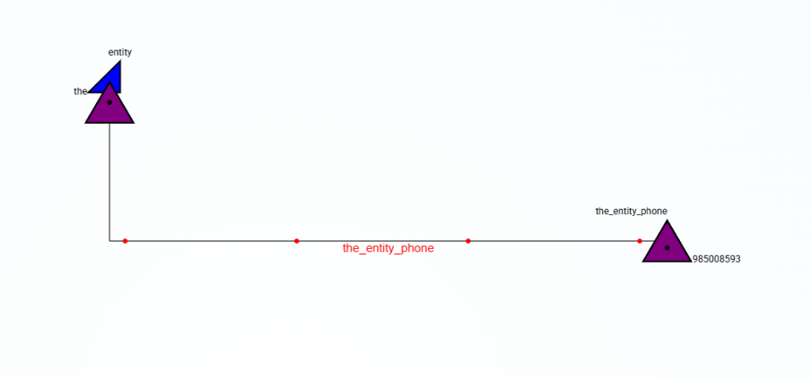

## 

# Connection

**Connection** define relationships between concepts, enabling flexible and scalable data management. For example, a connection could describe the relationship between a "User" and a "Product" they purchased or between a "Person" and the "Company" they are employed by. Connection can be of two kinds: **Type Connections** and **Compositional Connection**.


Connections can be created using the following function. Here a connection describes the relationship between two concepts.
to create a connection you basically need 3 concepts. One is ofTheConcept(Origin or starting point of the connection). 
Type Concept(This concept defines the relationship between two concepts, this can be anything such as the_entity_name, the_entity_email etc.) and toTheConcept(Destination or ending point of the connection).

A connection has other things such as order which are kept as default 1000 for these types of connections, we also add a typeString parameter which is the characterValue of the Type Concept, this is so that we have easier access of connection type, userId is optional because this is created in the backend based on the user creating this connection.

```
async  function CreateTheConnectionLocal(ofTheConceptId:number, toTheConceptId:number, 
     typeId: number,orderId:number = 1, typeString: string = "", userId: number = 999, actions: InnerActions = {concepts: [], connections: []}
    
```
- **ofTheConceptId:** The id representing the starting concept (e.g., a person).  
- **toTheConceptId:** The id representing the concept being connected (e.g., a product).  
- **typeId:** Defines the type of the connection between two concepts.  
- **orderId :** This is the value that defines the order of the connection, keep it as 1000.  
- **typeString:** This is the string that defines the connection type between the two concepts. This is required if you want to use connection locally.
- **userId (Optional):** This is the userId of the user creating it.
- **InnerActions:** You can skip this.


**Delete a connection**
Any editing in the system can be done via a connection delete. If you want to delete a connection then you must have access to that connection. If you have a connection from the instance of the_entity to the instance of the_lastname called the_entity_lastname then if you want to update the_entity_name relationship then you have to delete the connection between the instance of the_entity and the instance of the_name i.e. the_entity_name and then create a new connection with a new instance of the_name.

  


To Delete a connection you must use this function
```
DeleteConnectionById(16574158);

```

Response 
```
{
    "success": true,
    "message": "Deleted"
}

```

If you do not have access to delete the connection then you will get a response like

```
{
    "success": false,
    "message": "Cannot delete the connection"
}
```
  

  Access to the connection is determined by the creator of the connection. If your userId has created the connection then you will have access to delete it.


  But you might ask what if i do not know the id of the connection, then there is another function that lets you delete the existing connection by just the connection type. So let's say you want to delete the connection the_entity_phone from the_entity then you must use

  ```
  // this function deletes the connection if you have of_the_concept_id and the connection type.
    DeleteConnectionByType(100821886, 'the_entity_phone');

  ```

  Now you can add a new Connection and edit the ontology.


