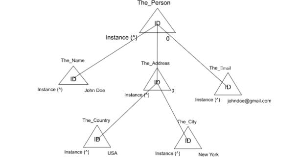

## 

# Connection

**Connection** define relationships between concepts, enabling flexible and scalable data management. For example, a connection could describe the relationship between a "User" and a "Product" they purchased or between a "Person" and the "Company" they are employed by. Connection can be of two types: **Data Connection** and **Compositional Connection**.

Connection define relationships between concepts. These relationships allow for scalable data management. For example, a connection might define the relationship between a "User" and a "Product" they purchased.

**Code Example:**
```typescript
CreateConnectionBetweenTwoConcepts(
    ofTheConcept: Concept,
    toTheConcept: Concept,
    linker: string,
    both?: boolean,        
    count?: boolean 
); 
```

- **ofTheConcept:** The object representing the starting concept (e.g., a person).  
- **toTheConcept:** The object representing the concept being connected (e.g., a product).  
- **linker:** Describes the relationship (e.g., "Purchased", "EmployedBy").  
- **both (Optional):** If set to true, creates a bidirectional connection.  
- **count (Optional):** Tracks how many times this connection has occurred


  ### **a. Data Connection**

  A Data Connection is a straightforward relationship between two distinct concepts. For instance, if you have a concept for "John Doe" (as a person) and "Laptop" (as a product), a connection can be created to describe that "John Doe" purchased a "Laptop."  
    
  
  **Code Example:**
  ```typescript
  CreateConnectionBetweenTwoConcepts(  
      personConcept,  // John Doe's concept object  
      productConcept, // Laptop's concept object  
      "Purchased"     // Describes the relationship  
  );
  ```


In this example:

  1. **personConcept:** Represents the instance concept for "John Doe" (type: "the\_Person").  
  2. **productConcept:** Represents the instance concept for "Laptop" (type: "the\_Product").  
  3. **"Purchased":** This string describes the connection or relationship between these two concepts.

  **Visual Representation**

  


  ### **b. Compositions Connection**

  Compositional connections are used to define detailed, complex ideas by grouping related data into a single, cohesive structure. A composition is an instance of a type and is used to describe something like a person, object, or entity in detail. For example, the composition for a person could include their name, address, email and other defining properties.

    
**Code Example:**
```typescript
   let personComposition \= {
       'Person' : {
        'Name': 'John Doe',
        'Address': {
           'Country': 'USA',
           'City': 'New York'
        },
        'Email' : 'johndoe@gmail.com'
      } 
   };

   makeComposition(personComposition, userId);
```  

  In this case, the composition groups several related data points ‘Name’, ‘Address’, and ‘Email’ to describe the "Person" entity (John Doe) comprehensively. Compositional concepts are more complex and allow the representation of an entity that holds multiple properties under a single concept.

  
  **Visual Representation**
  
  
  