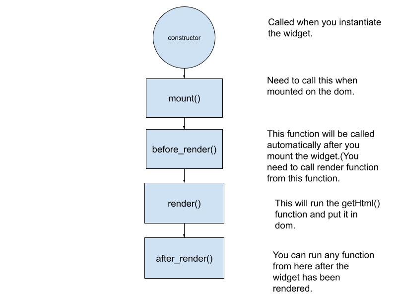

## Lifecycle

Each widget has a lifecycle. Currently we have Mounting and Updating.

Mounting is Putting the widget in the DOM.

In Stateful widget you need to define a method called getHtml() which will return a string. The html that is defined in this getHtml() section is rendered.

If there is any data that needs to be added to this widget the best place to call it is in before_render(). Currently we need to add this.render() inside of the before_render() once the data has been loaded.

after_render() is called when the widget has been added to DOM and you need to add user functionality there.
after_render is called after the new element is rendered to the dom.

This can be shown in the lifecycle below

There are also sections for the update of the widget and children widgets inside of the widget, these will be explained in the Phonebook example.
