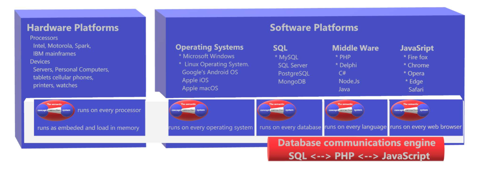

# Overview

Welcome to **freeSCHEMA**, a revolutionary semantic schema designed to simplify data management and software development. Whether you are a front-end developer or a full-stack developer, freeSCHEMA will streamline your work and increase development speed by 50-75%.

The SCCS(Semantic Concepts Connection System) is loaded with thousands of concept categories and types that saves programmers time
in completing software development projects by making seamless interfaces from one
development environment to another development environment in an organization’s software
infrastructure.
Programmers faced challenges with learning multiple data structures in order to store and share
data between different systems can now use a single command driven concept connection interface
and communication system. The SCCS concept connection framework and engine takes English
commands to give users control over the security and access to their data on all software and
hardware systems in their intelligence network.

This guide will walk you through the basics to get you up and running.

## What is data fabric ? 
A Data Fabric is an intelligent naming system for the organization of a framework and software
engine used to manage and communicate data between multiple intelligent endpoints.

## The SCCS Data Fabric
The SCCS Data Fabric is a semantic language framework that is a compact (uses 3-14 tables with
9-17 field names) and platform-independent engine (runs on every software hardware and
operating system) for the secure communication of data concepts and their connections.
The freeSCHEMA Data Fabric allows users to create:
- Concepts of any category and type
- Compositions of connection types
- Security settings
- Access gateways to their data
- A history of updates
To represent all of their data, ideas and thoughts.

## What is freeSCHEMA?

The freeSCHEMA Semantic Concept Connection System (SCCS) is a platform-independent,
semantic schema using 3-14 tables with 18 distinct variables, an ontology engine, data
communications fabric secured by AI and an integrated development environment and
naming system that simplifies data management by providing a type casting system that
follows the rules of English allowing software developers to work directly with stakeholders
Programmers simply use CRUD operations on their local concepts and connections tables
and the data fabric does the rest.

freeSCHEMA is a semantic data communications fabric that connects concepts and manages
data across platforms using a single, unified approach. It eliminates the need for traditional
backend development, allowing developers to focus on creating robust front-end applications.
The system integrates with C#, JavaScript and Node.js, providing a powerful, easy-to-use
solution for full-stack development. The system provides a data communications fabric that
allows programmers to create concepts and connections on any software platform including
C#, Node.js,  JS.

## Overview of freeSCHEMA

freeSCHEMA provides a universal solution for managing, storing, and retrieving data across
multiple platforms and systems. By using a semantic data fabric, freeSCHEMA enables
natural language processing, allowing developers to interact with data more intuitively.
Companies now burdened with three tiers of programmers (SQL/PHP/JavaScript) will be
able to reduce their programming burden to a single tier of JavaScript developers.
Moreover, with its built-in AI capabilities, data security, and complete platform independence,
freeSCHEMA reduces the complexity of data management and software development
helping businesses reduce development costs and improve scalability.
freeSCHEMA™ defines the next logical evolutionary step in software development with the
first platform independent, user centric, concept-based data fabric development and
access suite to consolidate information and provide secure access to data using the concepts
of normalized English language taxonomies.

## Key Features of freeSCHEMA

- **The Semantic Concept Connection System (SCCS):** The core of freeSCHEMA, allows developers to create, manage, and connect concepts using a semantic structure.
- **Platform Independence:** Works seamlessly across operating systems, programming languages, and platforms like SQL, Node.js, C#, JavaScript, and all software languages.
- **Automatic Data Backup and History:** All data changes (additions, edits, deletions) are automatically saved, meaning you don’t have to worry about losing data.
- **Built-in AI and Security:** AI-driven analytics, anomaly detection security are built into the system, enhancing data integrity and insight generation.
- **Built-in Session Data:** Session data automatically tracked and marked with audit trails of programs and sessions writing data.
- **Built-in Role-Based Access Control:** Provides role-based access to users' data so users can grant permissioned access to their personal and corporate data.

## Understanding Concepts and Connections in freeSCHEMA

At the core of freeSCHEMA are **Concepts** and **Connections**, which enable the creation of flexible, reusable, and scalable data structures. 

**- Type Concepts** serve as the foundation for reusable templates, while **Instance** and **Compositional Concepts** allow for detailed data representation. 

**- Connections** define the relationships between these concepts, adding depth and interactivity to the data model. 

This architecture supports a robust framework for effectively managing complex data relationships.
