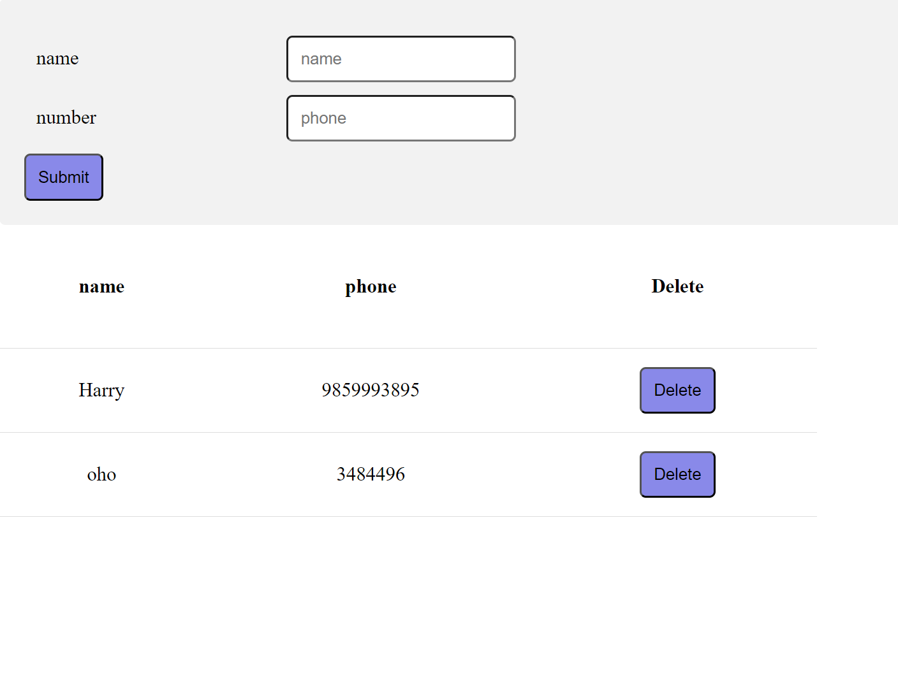

We now have a create and list section but both are in different web pages. Let's suppose we want to keep them side  by side and once the new data is created we need to list it in the list component.

This needs that both of them are placed in the same component. This will help you manage all of your widgets from a single  page then you need this.

To create a wrapper widget we need to first create a widget.


```
import { StatefulWidget } from "../../default/StatefulWidget";
import { create } from "./create.example";
import { list } from "./list.example";
import './phonebook.style.css';

export class phonebook extends StatefulWidget
{
}
```

Then we will add Html section for the widget

```
     getHtml(): string {
        let html = "";

        html = `<div class="flex-container">
                    <div id= "widget1"></div>
                </div>
                <div class="flex-container">
                    <div id ="widget2"></div>
                </div>`
        return html;
    }
```

Here we are defining the widget as widget1 and widget2 . This is just created as a wrapper for each of the widget.


Again we need to then mount the child widgets inside of it. So we call another function that just does that.

We have to assign each widget to the wrapper it is associated with. 

```
    mountChildWidgets(){
        let widget1 = this.getElementById("widget1");
        let widget2 = this.getElementById("widget2");
        let creating =new create();
        let listing = new list();

         if(widget1){
           this.childWidgets.push(creating);
           creating.mount(widget1);
         }
         if(widget2)
         {
            listing.dataChange((value: any)=>{
                this.UpdateChildData(value, creating);
            });
            this.childWidgets.push(listing);
            listing.mount(widget2);
         }

         
    }
```


Then in routes section update the new route to show this wrapper widget

Add the following to the routes.ts inside RouteParams array.

```
  {
    path: "/phonebook",
    linkLabel: "Phonebook",
    content: phonebook,
    isAuthenticated: true
  },
```

Now here you can see how the different components interact with each other. When creating a new phonebook data you can see that the list is automatically udpated because the list is listening to the new type the_phonebook. Anything that is inserted into the memory tree inside throws an event and if the widget should be listening to this event then the widget will automatically update itself.


You must see something like this when you go to /phonebook route.


