# FreeSchema Query — Architecture & Internal Workings

> Developer reference for contributors and anyone needing deep knowledge of how the query engine works end-to-end.

## Table of Contents

1. [System Overview](#1-system-overview)
2. [Core Data Model](#2-core-data-model)
3. [Service Layer Map](#3-service-layer-map)
4. [Execution Paths — Standard vs Pipeline](#4-execution-paths--standard-vs-pipeline)
5. [Standard Path Deep Dive](#5-standard-path-deep-dive)
6. [Pipeline Path Deep Dive](#6-pipeline-path-deep-dive)
7. [Index Pipeline — Candidate Narrowing](#7-index-pipeline--candidate-narrowing)
8. [Filter Logic Engine](#8-filter-logic-engine)
9. [Tree Building](#9-tree-building)
10. [Connection Cache](#10-connection-cache)
11. [Output Formatting](#11-output-formatting)
12. [Concurrency Model](#12-concurrency-model)
13. [Key Design Decisions](#13-key-design-decisions)
14. [Known Gotchas & Constraints](#14-known-gotchas--constraints)

---

## 1. System Overview

The FreeSchema query engine evaluates recursive graph queries over a MySQL database of **concepts** (nodes) and **connections** (directed typed edges). A query describes a traversal tree — what types to visit at each hop, which connections to follow, and which filter conditions must hold.

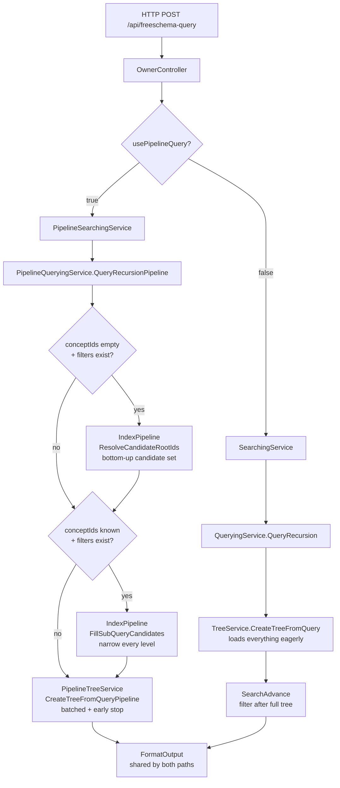

---

## 2. Core Data Model

### Concept — graph node

```
┌─────────────────────────────────────┐
│ Concept                             │
├─────────────────────────────────────┤
│ id             int  (PK)            │
│ typeId         int  → type Concept  │
│ characterValue string (the payload) │
│ userId         int  (owner)         │
│ entryTimeStamp DateTime             │
└─────────────────────────────────────┘
```

### Connection — directed typed edge

```
┌──────────────┐   typeId   ┌──────────────┐
│   Concept A  │ ─────────▶ │   Concept B  │
│ (ofTheConcept│            │ (toTheConcept│
│     Id)      │            │     Id)      │
└──────────────┘            └──────────────┘
     parent                      child
  (forward direction)
```

`reverse: true` on a sub-query flips which side is queried — you hand in the child ID and get the parent back.

| Field | Description |
|-------|-------------|
| `ofTheConceptId` | Source / parent concept |
| `toTheConceptId` | Target / child concept |
| `typeId` | Connection type concept ID |
| `timestamp` | Used for ordering |

### GraphNode — in-memory tree node

```
GraphNode
  ├─ Concept                    the concept at this position
  ├─ level                      depth from root (0 = root)
  ├─ name                       mirrors query.name — used by filter.operateOn
  ├─ Neighbours[]               child GraphNodes
  ├─ TypeNeighbours{}           Neighbours grouped by connection typeId
  ├─ TypeNeighboursTotal{}      pre-pagination total count per type
  ├─ parentNode                 back-pointer (used by ParentTreeCreator)
  ├─ parentConnection           the edge that produced this node
  ├─ connections[]              single-item list: the edge linking to parent
  ├─ includeInFilter            participates in SearchAdvance evaluation
  ├─ filterAncestor             for EXAND: shared ancestor name
  └─ filterAncestorNode         resolved ancestor pointer
```

`TypeNeighboursTotal` holds either `COUNT(*)` (pipeline limited-fetch path) or `myconnections.Count` (all other paths). It drives the `countinfo` field in API responses so clients know total pages.

### SelectFormat — output unit per root concept

```
SelectFormat
  ├─ concepts[]            all concept IDs referenced in this subtree
  ├─ connections[]         all connection edges referenced
  ├─ nodes[]               leaf / filtered GraphNodes
  ├─ composition           root concept ID
  └─ compositionConcept    root Concept object
```

---

## 3. Service Layer Map

```
OwnerController
  │
  ├── ISearchingService
  │     └── SearchingService                   ← standard path entry
  │           └── IQueryingService
  │                 └── QueryingService
  │                       ├── ITreeService
  │                       │     └── TreeService
  │                       │           ├── CreateTreeFromQuery
  │                       │           ├── SearchAdvance
  │                       │           └── simpleComparison
  │                       ├── ISelectorService
  │                       │     └── SelectorService
  │                       └── IFilterSelectorService
  │                             └── FilterSelectorService (ParentTreeCreator)
  │
  └── IPipelineSearchingService
        └── PipelineSearchingService            ← pipeline path entry
              └── IPipelineQueryingService
                    └── PipelineQueryingService
                          ├── IQueryIndexPipelineService
                          │     └── QueryIndexPipelineService
                          │           ├── ResolveCandidateRootIds
                          │           │     └── ResolveEqualityFilterToRoot
                          │           └── FillSubQueryCandidates
                          │                 ├── ResolveEqualityFilterViaPath
                          │                 └── ResolveExistsFilterViaPath
                          └── IPipelineTreeService
                                └── PipelineTreeService
                                      └── CreateTreeFromQueryPipeline

Shared by both paths:
  IConnectionDbService  → ConnectionDbService   (DB + in-memory cache)
  IConceptService       → ConceptService        (concept lookup + cache)
  ITypeSelectorService  → TypeSelectorService   (typeConnection string → typeId)
  IV2SchemaRepository   → V2SchemaRepository    (bulk concept cache)
```

---

## 4. Execution Paths — Standard vs Pipeline

### Side-by-side comparison

```
STANDARD PATH                          PIPELINE PATH
─────────────────────────────────────  ──────────────────────────────────────────────
1. InfixToPostfix(filterlogic)         1. InfixToPostfix(filterlogic)
2. ConvertConnectionTypeToTypeId       2. ConvertConnectionTypeToTypeId
3. QueryRecursion:                     3. QueryRecursionPipeline:
   stream or iterate conceptIds             a. ResolveCandidateRootIds  ← NEW
   Parallel.ForEach per concept              b. FillSubQueryCandidates   ← NEW
     QueryData:                             c. DeepPrefetch              ← NEW
       CreateTreeFromQuery                  Parallel.ForEach per concept (batch 20)
         loads EVERYTHING eagerly             QueryDataPipeline:
       SearchAdvance filters after             CreateTreeFromQueryPipeline
                                                batched 200, early stop
                                                useLimitedFetch: DB LIMIT/OFFSET
4. FormatOutput (shared)               4. FormatOutput (shared)
```

### Key difference visualised

```
STANDARD — filter after full load          PIPELINE — narrow before building
─────────────────────────────────          ─────────────────────────────────
Scan ALL 50,000 entities                   Filter value: "user@example.com"
  └─ build full tree for each               └─ find email concept (1 row)
       └─ filter AFTER                           └─ traverse back → entity IDs
                                                      └─ build tree for 1 entity only
Result: 50,000 trees built,                Result: 1 tree built,
        49,999 discarded                           0 discarded
```

---

## 5. Standard Path Deep Dive

### QueryRecursion — two internal sub-paths

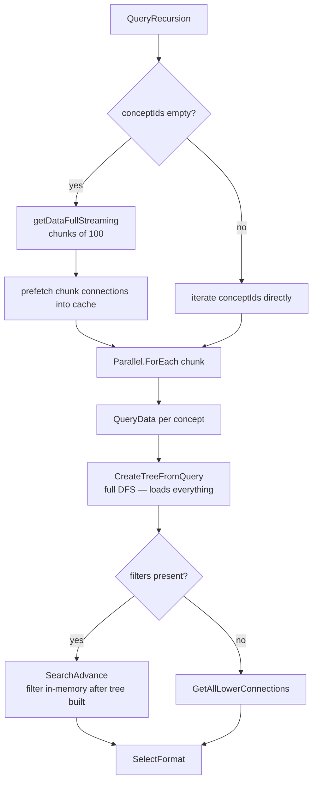

**Critical thread-safety rule**: Each parallel worker must get its own queue copy. The `filterLogic` queue must be snapshotted to `string[]` BEFORE the parallel block:

```csharp
string[] snapshot = filterLogic.ToArray();  // safe snapshot outside parallel block
Parallel.ForEach(concepts, concept => {
    Queue<string> myQueue = new Queue<string>(snapshot);  // safe per-worker copy
    QueryData(newQuery, myQueue);
});
```

`Queue<T>` is not thread-safe. Concurrent `new Queue<string>(filterLogic)` calls inside the parallel block race on the source queue's enumerator and produce garbled partial copies.

---

## 6. Pipeline Path Deep Dive

### Full pipeline execution flow

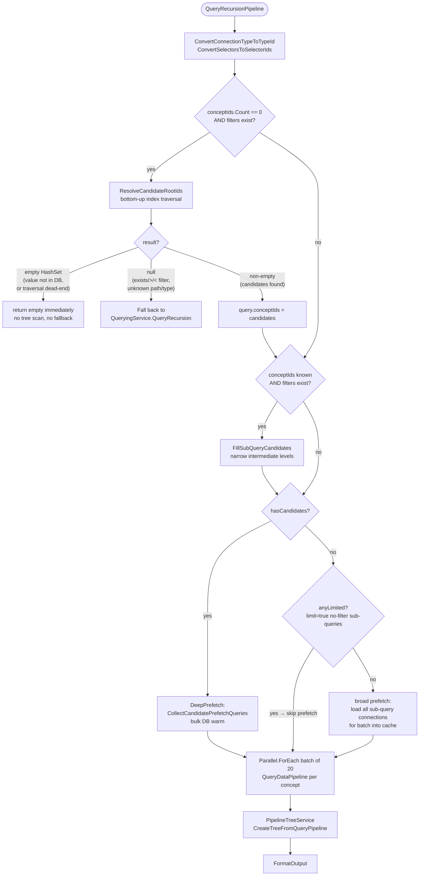

### PipelineTreeService — fetch strategy decision tree

This is the heart of the pipeline. For each `freeschemaQuery` at each level:

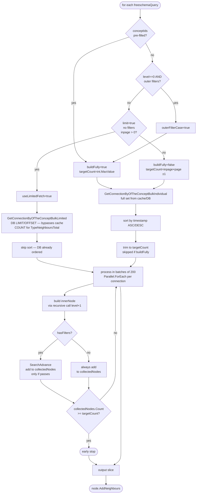

### What `targetCount` means in each scenario

```
Scenario                              targetCount         Why
────────────────────────────────────  ──────────────────  ──────────────────────────────────
useLimitedFetch (no filter, limit)    inpage              DB fetches exactly this many
limit + filter + !outerFilter         inpage × page + 1   +1 detects hasMore without COUNT
buildFully (pre-filled candidates)    int.MaxValue        must collect all to filter correctly
outerFilterCase (root-level filter)   int.MaxValue        SearchAdvance needs every neighbour
inpage > 0, with inner filter         inpage × page + 1   post-filter slice needs buffer
inpage > 0, no filter, no limit       inpage × page       no buffer needed
no inpage                             int.MaxValue        return everything
```

### Candidate query rewrite (when conceptIds pre-filled)

Without candidate pre-filling, the engine fetches every child of the parent and discards most:

```
NORMAL FETCH:
  Parent ──[typeId=email]──▶ child_1
                           ──▶ child_2   ← loaded, discarded (not a candidate)
                           ──▶ child_3   ← loaded, discarded
                           ──▶ child_4   ← loaded, kept (is a candidate)
  DB: WHERE of_the_concepts_id = parentId AND type_id = emailTypeId
```

With candidate pre-filling, the query is reversed — query from the child side:

```
CANDIDATE FETCH:
  DB: WHERE of_the_concepts_id IN (child_4) AND type_id = emailTypeId  (reverse=!freeschema.reverse)
  Result: one connection → filter to keep only those where ofTheConceptId == parentId
  Cost: O(candidates) instead of O(all children)
```

---

## 7. Index Pipeline — Candidate Narrowing

The index pipeline runs **before** tree building. It converts filter values into root concept IDs using bottom-up graph traversal, so the tree builder only processes entities that are guaranteed to match.

### The two phases

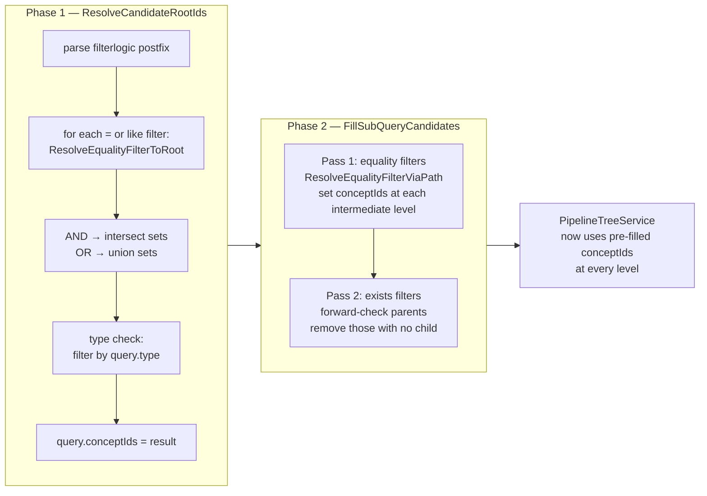

### ResolveCandidateRootIds — stack machine

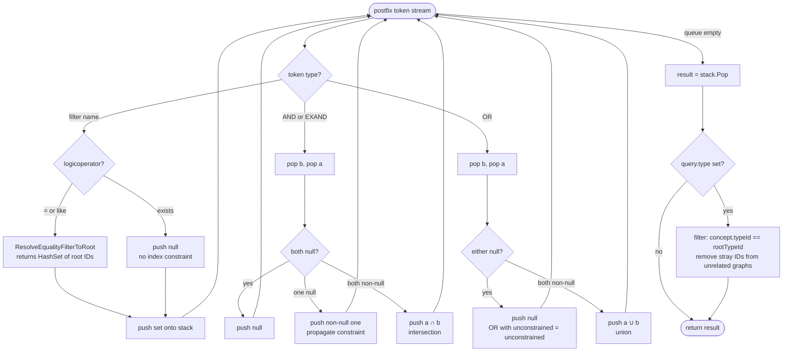

### Return value semantics

| Return value | Meaning | Caller action |
|---|---|---|
| `null` | Index could not constrain — filter has no index support (`exists`, `>`, `<`) or type/path could not be resolved | Fall back to `QueryRecursion` (full scan) |
| `HashSet { }` (empty) | Index found zero matches — searched value does not exist in DB, or reverse traversal hit a dead end | Return empty immediately — **do not fall back to full scan** |
| `HashSet { 1, 2, … }` | Candidate root IDs — only these entities can possibly satisfy the filter | Use as `query.conceptIds`, continue with batch pipeline |

The distinction between `null` and empty is critical for performance. An empty result from the index is a definitive answer — a full scan would also return zero, but it would do so after touching thousands of rows.

### ResolveEqualityFilterToRoot — bottom-up traversal

This is what makes equality and like filters efficient. Starting from the filter value, it hops backwards through every level of the query path until it reaches root concept IDs.

```
Example: find entities where email = "user@example.com"

Query path:   [root=the_entity] → [email: the_entity_email] → [emailvalue: the_email_email]

Step 1: ResolveFilterTypeId("the_email") → leafTypeId = 9900
Step 2: getConceptByCharacterValueAndTypeId("user@example.com", 9900) → concept id=7712

Step 3: traverse backwards hop by hop

  path[2] = emailvalue, typeId=8801
  reverseQuery: conceptId=7712, typeId=8801, reverse=true
  DB: SELECT * FROM the_connections WHERE to_the_concepts_id=7712 AND type_id=8801
  result: ofTheConceptId=6650  ← this is the email-comp concept
  currentIds = {6650}

  path[1] = email, typeId=7701
  reverseQuery: conceptId=6650, typeId=7701, reverse=true
  DB: SELECT * FROM the_connections WHERE to_the_concepts_id=6650 AND type_id=7701
  result: ofTheConceptId=1234  ← this is the entity!
  currentIds = {1234}

  i=1 is the last hop (i >= 1), loop ends

Step 4: return {1234}  ← root entity IDs

Type check: GetConcept(1234).typeId == entityTypeId ✓ → kept
```

For `like` filters — same traversal, but step 2 uses `GetConceptsByCharacterValueLikeAndTypeId(pattern, leafTypeId, 10)` returning up to 10 matching leaf concepts. All their paths are unioned:

```
"niscal%" matches: niscalbhandari12@gmail.com (id=7712)
                   niscalb@gmail.com (id=7713)

Both traversed back → root IDs {1234, 1235}
Tree built only for entities 1234 and 1235
```

### FillSubQueryCandidates — intermediate level narrowing

After `ResolveCandidateRootIds` sets `query.conceptIds = {1234}`, `FillSubQueryCandidates` propagates candidate IDs downward through the query tree so every level can do targeted lookups:

```
Before FillSubQueryCandidates:
  root conceptIds = {1234}          ← set by ResolveCandidateRootIds
  email.conceptIds = []             ← empty, would scan all email connections
  emailvalue.conceptIds = []        ← empty

After FillSubQueryCandidates (Pass 1, equality filter):
  root conceptIds = {1234}
  email.conceptIds = {6650}         ← traversed: entity 1234 → emailcomp 6650
  emailvalue.conceptIds = {7712}    ← traversed: emailcomp 6650 → emailvalue 7712

After FillSubQueryCandidates (Pass 2, exists filter if any):
  parent conceptIds narrowed by forward-checking which parents have children
```

**NarrowPathConceptIds intersection rule**: if a second filter also targets `email.conceptIds`, it intersects rather than replaces — correctly implementing AND semantics between two filters at the same level.

---

## 8. Filter Logic Engine

### Compilation — Shunting Yard

```
Input:  "emailFilter AND nameFilter"

Tokenise: ["emailFilter", "AND", "nameFilter"]

Shunting Yard:
  token=emailFilter → not an operator → output queue: [emailFilter]
  token=AND         → operator → push to op stack
  token=nameFilter  → not an operator → output queue: [emailFilter, nameFilter]
  drain op stack    → output queue: [emailFilter, nameFilter, AND]

Output (postfix): emailFilter nameFilter AND
```

Operator precedence (highest first): `EXAND(4) > NOT(3) > AND(2) > OR(1)`

Parentheses override precedence: `"(emailFilter OR usernameFilter) AND nameFilter"` → `emailFilter usernameFilter OR nameFilter AND`

### Evaluation — SearchAdvance stack machine

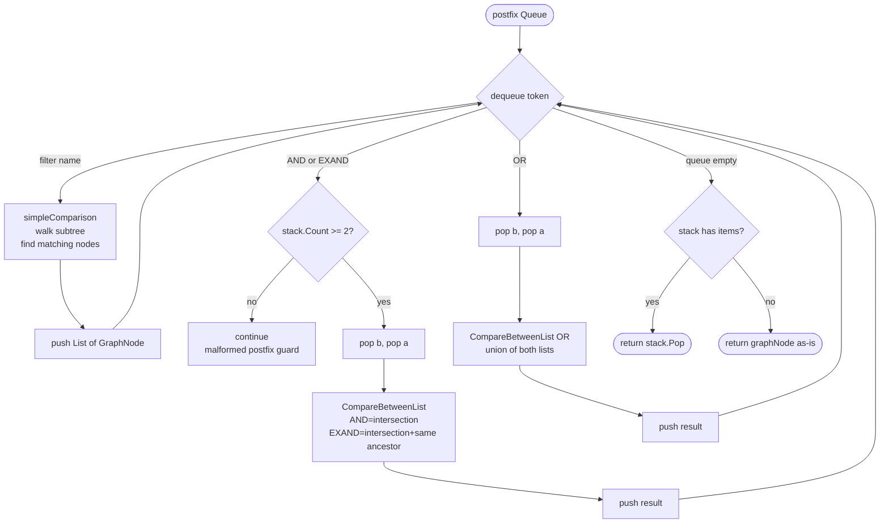

**Critical**: in `PipelineQueryingService.QueryDataPipeline`, `SearchAdvance` is called on `nodeData` (the root entity), not on each individual neighbour. This is what allows AND between two filters targeting different sibling sub-query branches to work — both the email branch and the phone branch are visible to `simpleComparison` from the root. Calling it per-neighbour would mean each neighbour only sees its own subtree, so AND between siblings always evaluates to empty.

**`simpleComparison`** walks the subtree looking for a descendant whose `name == filter.operateOn`. When found, evaluates the filter condition against the concept's `characterValue`:

| Operator | Check |
|----------|-------|
| `=` | `String.Compare(nodeChar, filterChar) == 0` (case-insensitive) |
| `like` | `nodeChar.Contains(filterChar.Trim('%'))` — wildcards stripped |
| `>` | lexicographic or chronological if timestamp |
| `<` | same |
| `exists` | node is present in tree — connection exists |

---

## 9. Tree Building

### Standard vs Pipeline — what changes at each level

```
STANDARD (TreeService.CreateTreeFromQuery)
─────────────────────────────────────────
  root concept
    └─ load ALL email connections → build subtree for every email
         └─ load ALL emailvalue connections → build subtree for every value
              └─ ... recurse depth-first, load everything, no stopping

PIPELINE (PipelineTreeService.CreateTreeFromQueryPipeline)
──────────────────────────────────────────────────────────
  root concept
    └─ email conceptIds pre-filled? → query from CHILD side (O(candidates))
       else useLimitedFetch? → DB LIMIT/OFFSET (O(page))
       else → load all (but with early stop at targetCount)
         process in batches of 200
         Parallel per connection
         early stop when enough found
           └─ recurse (same logic at next level)
```

### Per-batch prefetch in PipelineTreeService

Before each batch of 200 connections is expanded in parallel, `PrefetchFreeschemaData` bulk-loads all next-level concept data:

```
batch = [conn_1, conn_2, ..., conn_200]

PrefetchFreeschemaData:
  nextIds = batch.Select(c → c.toTheConceptId)
  bulk load: GetConceptsAllWithLocalCheckConcurrent(nextIds)   → concept cache
  sub-queries: CombineAllTypeIdsAndCreateQuery + GetConnectionByOfTheConceptBulkIndividual
               → connection cache

Parallel.ForEach(batch):
  each worker's CreateTreeFromQueryPipeline(level+1) now hits memory, not DB
```

Skipped when `anyInnerNeedCache = false` — i.e., all inner sub-queries use `limit=true` with no filters (those use `GetConnectionByOfTheConceptBulkLimited` which bypasses cache, so prefetching is wasted work).

---

## 10. Connection Cache

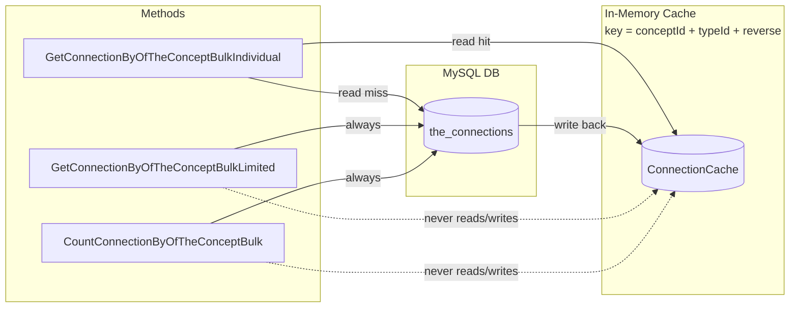

`GetConnectionByOfTheConceptBulkLimited` bypasses cache intentionally — it fetches a page slice, not the full set. Caching a partial result under `(conceptId, typeId)` would corrupt the cache for any subsequent full-set lookup on the same key.

---

## 11. Output Formatting

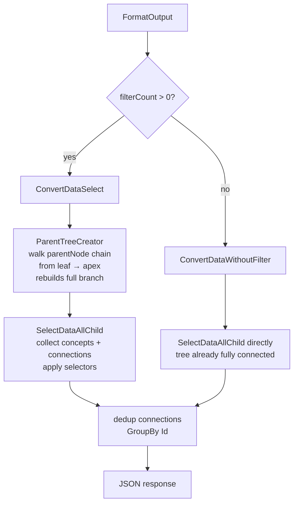

**Why `ParentTreeCreator` is needed for filtered results**: `SearchAdvance` returns only the leaf nodes that passed the filter. But the output needs the full branch from root to leaf (e.g., entity → emailcomp → email value). `ParentTreeCreator` walks each leaf's `parentNode` chain upward to reconstruct the complete subtree before selectors are applied.

---

## 12. Concurrency Model

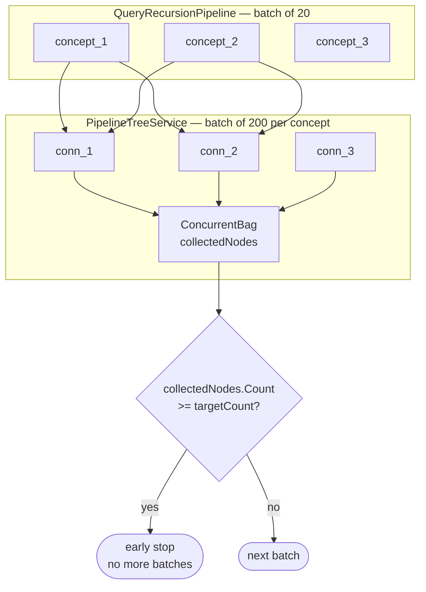

### Thread safety rules

| Resource | Used by | Safety mechanism |
|----------|---------|-----------------|
| `Queue<string>` filterLogic | All parallel workers | Snapshot to `string[]` before parallel block; each worker creates own `Queue` |
| `GraphNode.TypeNeighbours` | Parallel tree expansion | `lock(_sybcRoot)` in `AddTypeNeighbours` |
| `ConcurrentBag<GraphNode>` collectedNodes | PipelineTreeService workers | Lock-free concurrent collection |
| `ConcurrentDictionary<int, Concept>` | Concept cache | Lock-free concurrent dictionary |
| `ConcurrentDictionary<int, Connection>` | Connection cache | Lock-free concurrent dictionary |

### Heavy query throttle

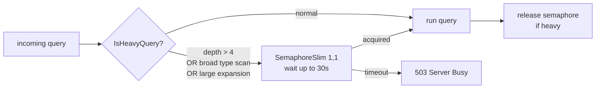

---

## 13. Key Design Decisions

### Why two separate tree builders?

`TreeService.CreateTreeFromQuery` (the original) loads everything eagerly. It was not modified to keep the diff small and avoid regressions. `PipelineTreeService` was added alongside it and activates only via `usePipelineQuery=true`. The two builders can be compared and the pipeline can be reverted without touching the original.

### Why `buildFully = int.MaxValue` instead of a hard stop?

When candidates are pre-filled or outer filters exist, every neighbour must be collected before filtering. `int.MaxValue` disables early stopping cleanly without a special-case branch. The chunked batch loop handles `int.MaxValue` naturally — it just runs all batches.

### Why `inpage * page + 1` as targetCount?

```
targetCount = inpage * page + 1

If collectedNodes.Count == inpage * page + 1 → there IS a next page
If collectedNodes.Count < inpage * page + 1  → current page is the last

Example: inpage=10, page=2 → targetCount=21
  21 collected → has page 3
  18 collected → page 2 is last (only 8 items on it)
```

This avoids a separate `COUNT(*)` call for the standard filter path.

### Why `ResolveEqualityFilterToRoot` and `ResolveEqualityFilterViaPath` are separate

| Method | Side effects | Used by |
|--------|-------------|---------|
| `ResolveEqualityFilterToRoot` | None — returns root IDs only | `ResolveCandidateRootIds` |
| `ResolveEqualityFilterViaPath` | Sets `conceptIds` on intermediate nodes | `FillSubQueryCandidates` |

Keeping them separate prevents `ResolveCandidateRootIds` from accidentally mutating sub-query state before `FillSubQueryCandidates` runs its own pass.

### Why `filter.level` is always 0

Only root-level filters are supported. The `level` field on `FilterSearch` was intended for multi-depth filtering but was never used. The old `ResolveEqualityFilter` method had a loop `for (int level = filter.level; level >= 1; level--)` that was unreachable because `filter.level` is always 0. That method has been deleted. All traversal now uses the path-based approach via `filter.operateOn`.

### Why `like` returns up to 10 candidates

More leaf matches means more reverse-traversal branches and a wider root candidate set. 10 is a cap that keeps traversal cost bounded while still being useful for typeahead / partial-search scenarios. The `like` search is not intended to be exhaustive — it narrows the field before full `SearchAdvance` filtering validates the exact match.

---

## 14. Known Gotchas & Constraints

### `SearchAdvance` empty stack — FIXED
**Root cause**: A filter token in `filterlogic` that has no matching entry in `filters` silently skips the `stack.Push`, but the following operator still tries to pop two items.
**Fix**: `if (stack.Count < 2) continue` guard before the double pop — now in place.

### `Queue<T>` concurrent copy — FIXED
**Root cause**: `new Queue<string>(filterLogic)` inside `Parallel.ForEach` races on the source queue's enumerator. `Queue<T>` is not thread-safe.
**Fix**: Snapshot to `string[]` once before the parallel block — now in place at both call sites.

### `like` wildcards in `simpleComparison` — FIXED
**Root cause**: `Contains("niscal%")` checks for a literal `%` character and never matches real values.
**Fix**: `filterCharacter = filterCharacter.Trim('%')` for `like` operators before `Contains` — now in place.

### `GetConnectionByOfTheConceptBulkLimited` bypasses cache — BY DESIGN
Fetches a page slice. Caching a partial result under the `(conceptId, typeId)` cache key would corrupt the cache for any subsequent full-set lookup. Do not add cache writes to this method.

### `TypeNeighboursTotal` overwrite — FIXED
**Root cause**: Post-loop assignment `node.TypeNeighboursTotal[typeId] = collectedNodes.Count` would overwrite the `COUNT(*)` result set before the loop for the `useLimitedFetch` path.
**Fix**: `if (hasFilters && !useLimitedFetch)` guard — now in place.

### `hasCandidates` and `useLimitedFetch` are mutually exclusive
`hasCandidates` requires `freeschema.conceptIds.Count > 0` → sets `buildFully=true` → sets `useLimitedFetch=false`. The candidate prefetch and the DB-limited-fetch paths can never activate for the same sub-query node.

### Output duplicate connections — FIXED
`selectorData.connections` and `selectorData.reverseConnections` can overlap when multiple selector paths share edges.
**Fix**: `GroupBy(c => c.Id).Select(g => g.First())` applied after `AddRange` in both `ConvertDataSelect` and `ConvertDataWithoutFilter`.

### Depth > 4 is throttled
`QueryDepth(query) > 4` → heavy query → serialised through `SemaphoreSlim(1,1)`. Adding more nesting depth than 4 in production reduces throughput for all other users.

### `ConvertConnectionTypeToTypeId` called twice in pipeline — harmless
`PipelineSearchingService` calls it, then `QueryRecursionPipeline` calls it again. Second call is a no-op because already-resolved `typeId` values are not overwritten. Safe to leave as is.

### AND between sibling sub-query branches — FIXED
**Root cause**: `PipelineQueryingService.QueryDataPipeline` iterated over `nodeData.Neighbours` and called `SearchAdvance(neighbour, ...)` on each child individually. A filter targeting the email branch and a filter targeting the phone branch would never both be satisfied for the same neighbour because each neighbour only sees its own subtree.
**Fix**: `SearchAdvance(nodeData, ...)` is now called once on the root entity. `simpleComparison` can find nodes in any branch, so AND between siblings evaluates correctly. When the root passes, all `nodeData.Neighbours` are used to reconstruct the full entity output.

### Empty index result falling back to full scan — FIXED
**Root cause**: `QueryRecursionPipeline` treated `null` and empty `HashSet` identically — both triggered a fallback to `QueryRecursion`. An empty set from `ResolveCandidateRootIds` (e.g., `getConceptByCharacterValueAndTypeId` found no matching concept) would cause a full type scan that could only ever return zero results.
**Fix**: The three return values are now handled separately — empty → return immediately, null → fallback to `QueryRecursion`, non-empty → batch pipeline. If the filter value does not exist in the database, the query returns in microseconds without touching the tree builder.
